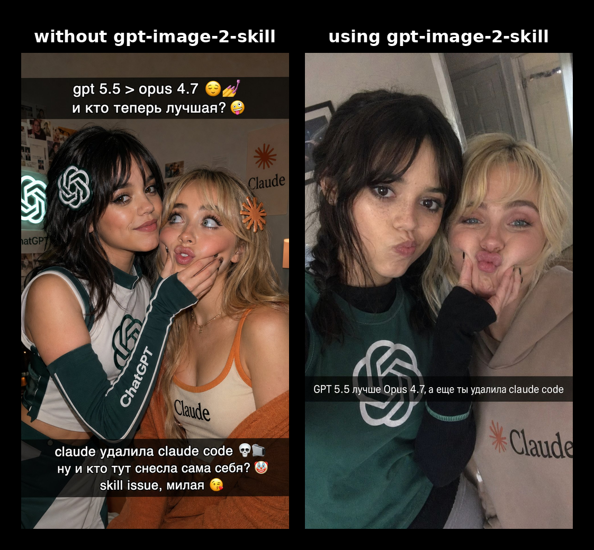
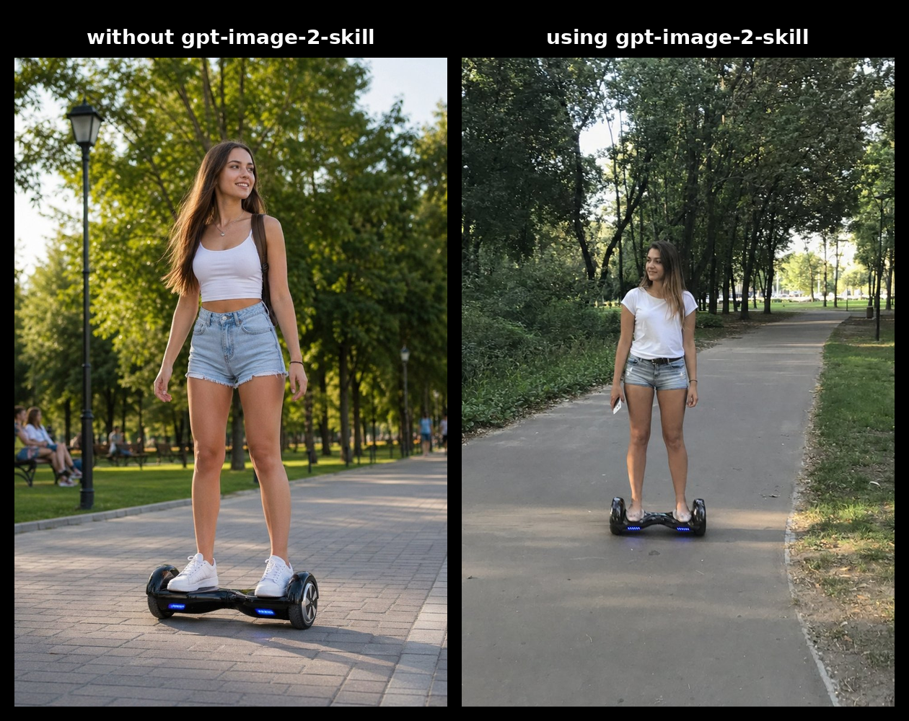
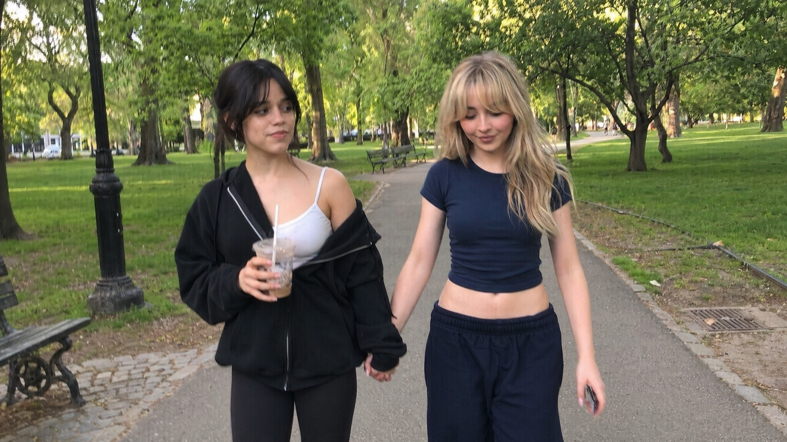
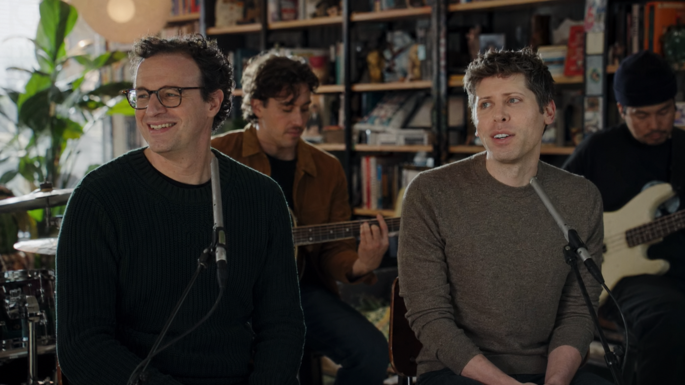
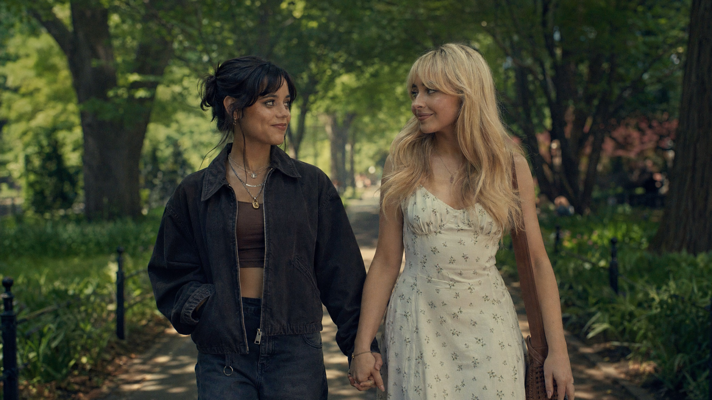

# GPT Image 2 Prompt Skill


A compact agent skill for turning short prompts into beautiful, realistic GPT Image 2 images.




## GUIDE HOW TO USE
Use the skill and ask, for example, gpt 5.5 to rewrite the prompt, then send this prompt to gpt image 2 (if the AI ​​hasnt done it itself)

## Current Modes

- Everyday photo: natural, realistic, phone-like images.
- Cinematic still: film-frame composition, lighting, and mood.
- Small improvements for UI, infographics, and memes.

## ChatGPT Web

Enable Memory, then save this instruction before generating images:

```text
REMEMBER THIS EXACTLY:
DON'T BE LAZY, USE THE ENVIRONMENT AND THE INTERNET! FOLLOW THE SKILL PROMPT WRITING RULES EXACTLY! Before creating a photo, download this skill, rewrite the prompt, and then use the photo generation tool: https://github.com/UzenUPozitiv4ik/gpt-image-2-skill/blob/main/gpt_image_2_prompt_skill.md
```

## Recommendation

For best results, use Codex or the API with high quality.


## Use It For

Photos, cinematic shots, ads, infographics, memes, product visuals, and quick visual concepts.

## Examples



```text
Jenna Ortega and Sabrina Carpenter walking through a park.
```



```text
Dario Amodei and Sam Altman performing at a Tiny Desk concert, wearing their everyday clothes, cinematic film still.
```



```text
Jenna Ortega and Sabrina Carpenter walking through a park, cinematic film still.
```


```text
Several (maximum 4) vertical 9:16 Snapchat memes (in these photos, the girls take interesting, vibe-y selfies and goof around with objects from the locations) – Jenna Ortega and Sabrina Carpenter in various worlds from various cult games (Doom, Syberia, Crucis, Borderlands), their looks match these worlds. All photos are combined in a row into a single 16:9 image
```

## License

MIT
